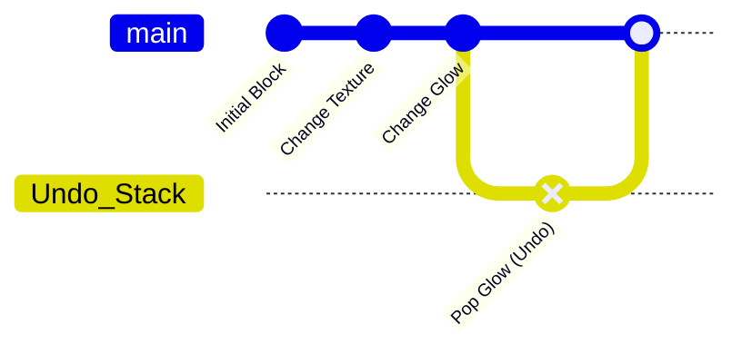
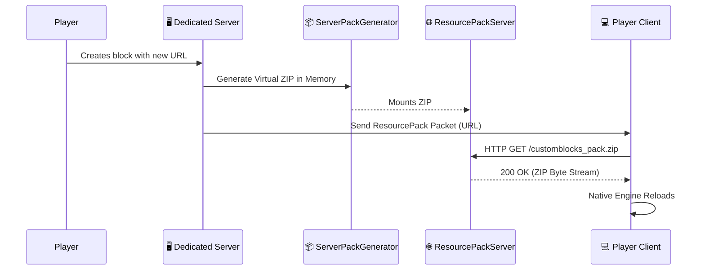

# 🧱 CustomBlocks
**Turn any image into a Minecraft block. No coding. Zero lag.**

> **Minecraft:** `1.21.1` | **Loader:** `Fabric` | **Author:** [Srb Gamer](https://www.youtube.com/@SrbGamerr)

CustomBlocks is a revolutionary, high-performance mod that allows server administrators and players to dynamically create custom-textured blocks entirely in-game. By utilizing an embedded HTTP server and advanced payload syncing, CustomBlocks streams textures directly from URLs onto blocks in real-time, completely bypassing the need for manual resource pack downloads or server restarts.

Whether you need a custom billboard, a decorative computer screen, or completely unique building materials, CustomBlocks generates them instantly.

---

## 📑 Table of Contents
1. [🌟 Core Features](#-core-features)
2. [🛠️ The Toolkit (Items)](#-the-toolkit-items)
3. [🖥️ In-Game GUI System](#-in-game-gui-system)
4. [⚙️ Under the Hood (Architecture)](#-under-the-hood-architecture)
5. [🌐 Network & Syncing](#-network--syncing)
6. [📋 Commands Reference](#-commands-reference)
7. [📜 Copyright & License](#-copyright--license)

---

## 🌟 Core Features

- 🖼️ **Dynamic Image-to-Block** — Paste any image URL (including `.gif` animations) to instantly map it to a block.
- 🎨 **Per-Face Texturing** — Map completely different textures to the top, bottom, north, south, east, and west faces of a single block.
- 📦 **Massive Capacity (1028 Slots)** — Supports up to 1,028 completely unique custom blocks at the same time without registry mismatches.
- 💡 **Advanced Attributes** — Control light emission (0-15), break hardness, and custom place/break/step sounds per block.
- 📐 **Shape Engine** — Built-in visual and collision shape editor. Set, add, remove, and save complex bounding boxes.
- ↩️ **Undo / Redo History** — Made a mistake? The engine features seamless, per-player history tracking.
- 📤 **Import & Export** — Share your block designs by exporting them to a file, or batch-import entire folders at once.

---

## 🛠️ The Toolkit (Items)

CustomBlocks provides a suite of deeply interactive, dynamically recolorable tools to manage your creations in-world:

| Item | Functionality |
|---|---|
| **🖌️ Lumina Brush** | Paints glow levels onto blocks instantly. |
| **⛏️ Amethyst Chisel** | Rapidly alters block hardness and shapes. |
| **🗑️ Deleter** | Safely removes custom blocks and clears their metadata. |
| **🟦 Color Square** | A dynamic item that changes its own color based on block interactions. |
| **🔺 Color Triangle** | Similar to the square, used for precision marking and metadata. |
| **⬡ Golden Hexagon** | A premium administrative tool for advanced block manipulation. |

---

## 🖥️ In-Game GUI System

Say goodbye to typing endless commands. CustomBlocks features a massive, custom-built node-style interface inside Minecraft.

### The Immediate-Mode Engine
Powered by over 9,400 lines of code, the GUI engine renders buttons, sliders, text inputs, and color pickers dynamically. 
- **`GuiMode.java` Contexts:** Seamlessly swap between the `MAIN_MENU`, `BLOCK_EDITOR`, `TEXTURE_PICKER`, and `SHAPE_EDITOR`.
- **The Back-Stack:** The GUI utilizes an `ArrayDeque` stack to save your exact `GuiState`. When you dive three menus deep to change a specific texture, pressing "Back" restores your previous menu exactly as you left it.
- **Color Library:** A custom color selection matrix supporting HSV/RGB blending for perfect tinting.

---

## ⚙️ Under the Hood (Architecture)

### 💾 SlotManager & Immutability
Minecraft requires blocks to be registered at startup. CustomBlocks bypasses this by pre-registering 1028 generic `SlotBlock` instances. The `SlotManager` dynamically binds metadata (like URLs and glow levels) to these slots.

> **Crucial Engine Rule:** All block data (`SlotData`) is strictly **immutable**. 
> You cannot mutate a block's texture directly in memory. Modifying values in place breaks the history tree and corrupts saves. Instead, the engine uses an `.update()` builder pattern to generate new state snapshots safely.

### ↩️ The UndoManager Engine
Whenever the `SlotManager` updates a block, the `UndoManager` intercepts the previous state and pushes it onto a history stack for that specific player.

### 🔍 Search & Filtering
- **`SearchIndex.java`**: A custom high-performance indexing system allows you to search through hundreds of custom blocks instantly in the GUI without any lag spikes.

---

## 🌐 Network & Syncing

Minecraft's native networking (`CustomPayload`) has strict packet size limits, making it impossible to send massive image files natively. CustomBlocks solves this using a brilliantly engineered split architecture.

### How the Magic Works:
1. When a custom block is created, `ServerPackGenerator.java` dynamically generates a virtual ZIP Resource Pack in memory containing the new JSON models.
2. `ResourcePackServer.java` spins up a micro HTTP server locally on the dedicated server host.
3. It sends a standard Minecraft Server Resource Pack packet to the client, pointing to `http://<server-ip>:<port>/customblocks_pack.zip`.
4. The client's native Resource Pack engine downloads it, applies the textures seamlessly, and re-renders the chunks—all in milliseconds.

---

## 📋 Commands Reference

*All commands start with `/customblock` (or the `/cb` alias).*

### Creation & Editing
- `create <id>` — Create a new custom block from a URL.
- `retexture <id> <url>` — Live-update the texture of an existing block.
- `resize <id> <scale>` — Resize the block's texture dimensions.
- `rename <id> <newname>` — Rename the block in the creative tab.
- `delete <id>` — Irreversibly delete a block.
- `dupe / duplicate <id>` — Clone a block and its settings exactly.
- `reid <id> <newid>` — Safely migrate a block to a new ID.

### Properties
- `setglow <id> <0-15>` — Control how much light the block emits.
- `sethardness <id> <value>` — Define how long it takes to mine.
- `setsound <id> <sound>` — Define place/break/step sounds.

### Shapes & Collision
- `setshape <id> <shape>` — Setup a predefined visual or collision boundary.
- `addshape / removeshape` — Modify components of a multi-part collision box.
- `saveshape / loadshape` — Save complex collision logic and reuse it.
- `setcollision on/off` — Toggle physical interaction.

### Utilities
- `give <player> <id>` — Give the item stack to a player.
- `undo / redo` — Step backward or forward in history.
- `export <id>` — Save the block metadata locally.
- `importfolder <path>` — Load all exported blocks from a directory.
- `list` — Show all registered custom blocks.
- `gui / editor` — **Open the visual block editor (Recommended)**.
- `admingui` — Open the server admin panel.
- `reload` — Soft-reload block data without restarting the server.

---

## 📜 Copyright & License

> **CAUTION:** This mod is **not open source**. It is protected under a custom copyright license. Before using, sharing, or including this mod anywhere, you must strictly adhere to the license terms.

هذا الـ Mod **ليس مفتوح المصدر**. وهو محمي بموجب ترخيص حقوق نشر خاص. 
قبل استخدام هذا الـ Mod أو مشاركته أو تضمينه في أي مكان — **اقرأ الترخيص أولاً**.

- 👉 **[Read the English License](LICENSE)**
- 👉 **[اقرأ الترخيص بالعربية](LICENSE-ar)**

---

**Architected by [Srb Gamer](https://www.youtube.com/@SrbGamerr)**
*Subscribe for more high-quality Minecraft modding content.*
