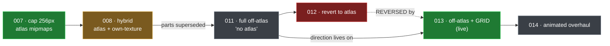
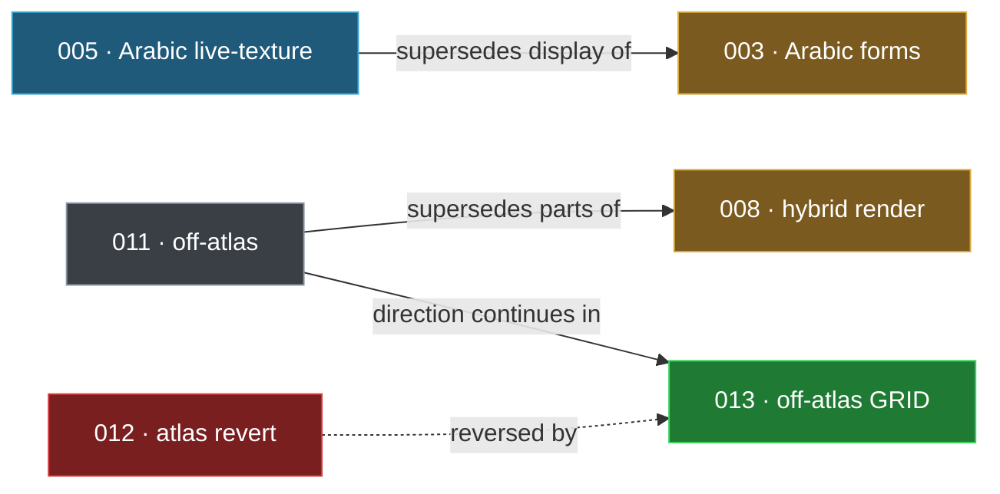

# Architecture Decision Records (ADR)

> [!IMPORTANT]
> An **ADR** = **one** design decision: what we chose, *why*, and what we rejected. The project's
> *"don't undo this"* memo — **decisions, not tasks.** Tasks live under the `G##-n` scheme
> (see [ID_MAP](../Information/ID_MAP.md)). ADRs keep their own `ADR-NNN` numbers — issues *link* to
> them, never rename them.

**One file, collapsible.** Every decision is a `▶` section below — **click a table row to jump**, **click a
summary to expand** the full record. *(Was 14 separate files; unified 2026-06-24 so nothing is scattered.)*

---

## 📊 At a glance — 14 ADRs

| ✅ live | 🛠️ pending in-game | 📋 planned | ⚠️ superseded | ⛔ reversed |
|:--:|:--:|:--:|:--:|:--:|
| **7** | **1** | **3** | **2** | **1** |

**Status key:** ✅ Accepted & live · 🛠️ Built, pending in-game · 📋 Accepted (plan, not built) · ⚠️ Superseded (in part) · ⛔ Reversed (dead)

---

## ✅ What's true *today*

The live, current decision for each area — start here:

| Area | Live ADR | In one line |
|---|---|---|
| **Slots / registry** | [001](#adr-001) | Fixed 1028-block pool; "create" = assign data to a free slot |
| **Rendering** | [013](#adr-013) (+ [007](#adr-007)) | Off-atlas + packed grid texture; atlas paths still capped at 256px |
| **Arabic auto-join** | [005](#adr-005) + [006](#adr-006) | Live BlockEntity textures (no pack reload) + virtual ids / live names |
| **Texture sync** | [004](#adr-004) + [010](#adr-010) | Mirror at choke points; dedicated servers get pack files directly |
| **Instant tools** | [009](#adr-009) | Client-predict colour-Square swaps |
| **Glow** | [002](#adr-002) | Glow stored as a BlockState property |

---

## 🗓️ Decision timeline

Every ADR in the order it was decided (newest at the bottom). **Now** = its status today.

| Date | ADR | One line | Now |
|---|---|---|:--:|
| 2026-06-03 | [001](#adr-001) | Fixed 1028 slot-block pool, claim a free slot to "create" | ✅ |
| 2026-06-04 | [002](#adr-002) | Glow = a BlockState property (not a luminance lambda) | ✅ |
| 2026-06-15 | [003](#adr-003) | Arabic contextual forms + hybrid hand-art / engine textures | ⚠️ |
| 2026-06-15 | [004](#adr-004) | Mirror named textures at the single-writer choke points | ✅ |
| 2026-06-18 | [005](#adr-005) | Draw auto-join Arabic with a BlockEntityRenderer + live textures | 🛠️ |
| 2026-06-19 | [006](#adr-006) | Arabic virtual ids + live config-driven names | 📋 |
| 2026-06-19 | [007](#adr-007) | Cap textures at 256px so the atlas can mipmap | ✅ |
| 2026-06-19 | [008](#adr-008) | Hybrid: atlas everywhere + own-texture close-up | ⚠️ |
| 2026-06-20 | [009](#adr-009) | Client-predict colour-Square swaps (look instant) | ✅ |
| 2026-06-20 | [010](#adr-010) | Deliver the pack to dedicated servers via file-sync | ✅ |
| 2026-06-20 | [011](#adr-011) | Full off-atlas for ALL blocks ("no atlas, forever") | 📋 |
| 2026-06-21 | [012](#adr-012) | Revert to atlas + `.mcmeta` (delete off-atlas) | ⛔ |
| 2026-06-21 | [013](#adr-013) | Keep off-atlas; pack frames into a square GRID texture | 🛠️ |
| 2026-06-21 | [014](#adr-014) | Animated overhaul — desync fix, real-clock speed, pooled render | 📋 |

---

## 📇 All ADRs

| ADR | Decision (plain English) | Status | Governs |
|---|---|---|---|
| [001](#adr-001) | **Pre-register 1028 slot blocks** — claim a free slot to "create"; dodges frozen-registry crashes | ✅ | core / slots |
| [002](#adr-002) | **Glow = a BlockState property**, not a luminance lambda (the old dead code) | ✅ | G06 Tools |
| [003](#adr-003) | **Arabic contextual forms + hybrid** hand-art / engine textures | ⚠️ display → 005 | G13 Arabic |
| [004](#adr-004) | **Mirror named textures at the single-writer choke points**, not per-command | ✅ | G05 Resource Pack |
| [005](#adr-005) | **Draw auto-join Arabic with a BlockEntityRenderer + live textures** — no pack reload | 🛠️ | G13 Arabic |
| [006](#adr-006) | **Arabic virtual ids + names computed at display time**; bundled letters → editable config | 📋 | G13 Arabic |
| [007](#adr-007) | **Cap textures at 256px (power-of-two)** so the atlas can still mipmap | ✅ | G14 Render |
| [008](#adr-008) | **Atlas everywhere + own-texture close-up renderer** | ⚠️ part → 011 | G14 Render |
| [009](#adr-009) | **Client-predict colour-Square swaps** so they look instant (server still authoritative) | ✅ | G06 Tools |
| [010](#adr-010) | **Deliver the pack to dedicated servers via file-level sync** | ✅ | G05 Resource Pack |
| [011](#adr-011) | **Render ALL custom blocks off-atlas** ("no atlas, forever") | 📋 → 012/013 | G14 Render |
| [012](#adr-012) | ~~Revert to atlas + `.mcmeta`, delete off-atlas~~ | ⛔ reversed by 013 | G14 Render |
| [013](#adr-013) | **Keep off-atlas; pack frames into a square GRID texture** (all frames, full-res) | 🛠️ | G14 Render |
| [014](#adr-014) | **Animated overhaul** — fix retexture desync, real-clock speed, pooled full-res render | 📋 | G14 Render |

---

## 🎞️ The render saga ([007](#adr-007) · [008](#adr-008) · [011](#adr-011) · [012](#adr-012) · [013](#adr-013) · [014](#adr-014))

Six ADRs, one evolving story about *how custom blocks are drawn*. Read in this order so the supersedes
don't confuse — **the live winner is ADR-013.** *(Diagram renders on GitHub; text fallback below it.)*



<details>
<summary>📄 Plain-text fallback (if the diagram doesn't render)</summary>

```
007  cap textures at 256px so the atlas can mipmap         (foundation, still true)   ✅
008  hybrid: atlas everywhere + own-texture close-up       parts superseded by 011    ⚠️
011  go full off-atlas for everything ("no atlas")         plan — overtaken below     📋
012  revert: delete off-atlas, go back to atlas+.mcmeta    REVERSED, never executed   ⛔
013  keep off-atlas; fix the frame cap with a grid texture the current decision       🛠️
014  animated-block overhaul (speed/desync/full-res)       next, builds on 013        📋
```
</details>

If you read one rendering ADR today: **[013](#adr-013)** (what we do) + **[007](#adr-007)** (why 256px).

---

## 🔗 Supersedes / reverses graph

How the decisions overrule each other across the whole set. *(GitHub renders the diagram; text below.)*



<details>
<summary>📄 Plain-text fallback</summary>

```
005  supersedes the DISPLAY mechanism of 003 (joining rules still stand)
011  supersedes the atlas-as-universal-layer parts of 008
012  REVERSED by 013 (012 was never executed)
011  off-atlas direction continues in 013 (the live decision)
```
</details>

---

## 🗂️ By group (reverse index)

| Group | ADRs |
|---|---|
| **G05 Resource Pack** | [004](#adr-004) · [010](#adr-010) |
| **G06 Tools** | [002](#adr-002) · [009](#adr-009) |
| **G13 Arabic** | [003](#adr-003) · [005](#adr-005) · [006](#adr-006) |
| **G14 Render / Animation** | [007](#adr-007) · [008](#adr-008) · [011](#adr-011) · [012](#adr-012) · [013](#adr-013) · [014](#adr-014) |
| **core / slots** | [001](#adr-001) |

---

## ➕ Adding a new ADR

Append a new record at the **bottom** of *Full records*, following the same shape as the others:

```
<details>
<summary><b>ADR-0NN · Title</b> — ✅ Accepted & live</summary>

<a id="adr-0NN"></a>

> **TL;DR** — one or two lines.

|  |  |
|---|---|
| **Status** | … | … (Date / Governs / Supersedes / Superseded by / Built?)

### Context / Decision / Rationale / Consequences
…
</details>

---
```

Then add **one row** to *All ADRs*, *Decision timeline*, and the *By group* index (+ the saga block and its
diagram if it's a rendering decision). Keep the status emoji current everywhere — the tables are the whole point.

---

# Full records — all 14 ADRs, in order
<details>
<summary><b>ADR-001 · Pre-register a fixed pool of 1028 slot blocks instead of dynamic registry</b> — ✅ Accepted & live</summary>

<a id="adr-001"></a>


> **TL;DR** — Claim from a fixed 1028-block pool; "create a block" = assign data to a free slot.
> Dodges Minecraft's frozen-registry crashes.

|  |  |
|---|---|
| **Status** | ✅ Accepted & live |
| **Date** | 2026-06-03 |
| **Governs** | core / slots (Phase 1) |
| **Supersedes** | — |
| **Superseded by** | — |
| **Built?** | ✅ yes (Phase 1) |


### Context
The mod must let players create "new" blocks at runtime with custom textures and
attributes. Minecraft/Fabric block registries are **frozen after mod initialization** —
you cannot safely add new block entries while the game is running. Any mismatch
between the set of registered blocks on the server and on a client produces registry
sync errors and disconnects.

### Decision
At mod init, pre-register a fixed pool of exactly **1028 generic `SlotBlock`
instances** (`slot_0` … `slot_1027`). Each slot is a real, registered block from the
game's point of view. At runtime, a slot is *assigned* a `SlotData` object that
defines its texture(s), attributes, and behaviour. "Creating a block" means claiming
a free slot and assigning it `SlotData`; "deleting" frees the slot. `SlotManager` is
the single source of truth for which slots are free, occupied, or reserved.

### Rationale
- The registry is identical on every client and server, so there are **no registry
  mismatch errors** (Success Criterion in §1) and no restarts are required.
- Runtime changes touch only `SlotData` (data) and resource-pack/texture delivery,
  never the registry itself.
- A flat, immutable `SlotData` model is easy to snapshot, undo/redo, and persist.

### Consequences
- Hard cap of 1028 custom blocks at once (acceptable per the SRS; FR-01-1, NFR-03).
- A small, fixed memory/registration cost for unused slots. Startup time must be
  benchmarked in Phase 1; if slow, registration can be batched (Risk Register).
- Requires `SlotManager` + `SlotDataStore` to track and persist assignments, and a
  texture-delivery pipeline (resource pack / client generation) since the block model
  itself is generic.

</details>

---

<details>
<summary><b>ADR-002 · Store block glow in a BlockState property, not a luminance lambda</b> — ✅ Accepted & live</summary>

<a id="adr-002"></a>


> **TL;DR** — Store a block's glow as a BlockState property (per-state luminance) instead of the old
> dead luminance lambda.

|  |  |
|---|---|
| **Status** | ✅ Accepted & live |
| **Date** | 2026-06-04 |
| **Governs** | G06 Tools |
| **Supersedes** | — |
| **Superseded by** | — |
| **Built?** | ✅ yes |


### Context
Blocks need configurable light emission (FR-04-1, 0–15) that can change at runtime via
`/cb setglow`. The obvious approach — `AbstractBlock.Settings.luminance(state -> liveValue)`
reading the slot's current glow — does **not** work.

Verified against the Minecraft 1.21.1 bytecode: `AbstractBlock.AbstractBlockState` has a
`private final int luminance` field that is computed **once** in the state's constructor
(`settings.luminance.applyAsInt(state)`), and `getLuminance()` simply returns that field.
Block states are constructed at **registration**, which happens before any slot data is
loaded or any glow is set — so the lambda is sampled once, returns 0, and is frozen at 0
forever. Mutating `SlotData` later has no effect on the cached value.

(The old project shipped exactly this dead lambda plus a `triggerGlowUpdate` that scanned
`chunk.getBlockEntityPositions()`. `SlotBlock` has no block entity, so that scan matched
nothing — its glow was effectively broken too.)

### Decision
Model light as a real **BlockState property**: `SlotBlock.LIGHT = IntProperty.of("light", 0, 15)`.
- `luminance(state -> state.get(LIGHT))` bakes each of the 16 states to its own correct value.
- `getPlacementState` applies the slot's configured glow (`SlotData.glow`) to new placements.
- `SlotData.glow` persists the configured default; the placed block's light is saved per-position
  in the chunk (so it survives reloads independently of slot data).
- `block/SlotLighting` rewrites the `LIGHT` state of already-placed instances near players when
  `setglow` runs (bounded scan: loaded chunks within a small radius, non-empty sections only).

### Rationale
- This is the vanilla-idiomatic approach (`LightBlock` uses a `LEVEL` IntProperty the same way).
- Luminance is correct because it is baked **per state** from immutable property data, not from
  external mutable state.
- No mixin required, so it works on dedicated servers and all clients.

### Consequences
- Each `SlotBlock` now has 16 states. The resource pack is unaffected: the generator's `""`
  catch-all variant matches every state (verified in the `BlockStatesLoader` bytecode — an empty
  variant key is an empty predicate that matches all states), so no missing-model / purple blocks.
- Changing glow on copies in unloaded chunks doesn't update them until they're revisited; this is
  acceptable because the per-position state is preserved and new placements use the configured glow.
- The same pattern (state property + `getPlacementState`) is the template for future per-block
  attributes that must affect rendering/behaviour live.

</details>

---

<details>
<summary><b>ADR-003 · Arabic contextual forms as a BlockState property; hybrid (hand-art + engine-drawn) textures</b> — ⚠️ Accepted — display mechanism superseded</summary>

<a id="adr-003"></a>


> **TL;DR** — Arabic letters pick a contextual form; textures = bundled hand-art + engine-drawn hybrid.
> The *display* mechanism is now via ADR-005, but the *joining rules* below still apply.

|  |  |
|---|---|
| **Status** | ⚠️ Accepted — display mechanism superseded |
| **Date** | 2026-06-15 |
| **Governs** | G13 Arabic |
| **Supersedes** | — |
| **Superseded by** | [ADR-005](#adr-005) (display only) |
| **Built?** | joining rules ✅ · display via ADR-005 |


> ⚠️ **Superseded (display only).** Decision parts **1 & 2** below — contextual form as a `SlotBlock`
> `FORM` blockstate property and a `ServerPackGenerator` 4-variant pack branch + `TextureStore` per-form
> textures — are **replaced by ADR-005**: forms are stored on a **letter BlockEntity** and drawn from a
> **live in-memory texture** (no pack rebuild, no reload). Pass 4 also uses a **new dedicated joinable
> letter block**, not the shared `SlotBlock` (reverses the "no new block class" argument in part 1).
> **Still valid:** the *joining rules* (which letters connect, RTL, the 6 non-connectors + cousins,
> numbers never join), part 3 (hybrid hand-art + engine-drawn forms / override folder), and part 4
> (colour = background). See ADR-005 for the current display path.

### Context

Group 13 must make placed Arabic **letter blocks auto-join**: a letter shows its
**isolated / initial / medial / final** form depending on its horizontal neighbours, and the
neighbours re-evaluate when a block is placed or broken (Issue 17.20 / O3). The developer also
wants the join direction **fully customizable at runtime** (axis E–W / N–S / follow-facing, flip
start end, an optional vertical mode, and a per-block manual override).

Two facts about the existing codebase shape the decision:

1. **Blocks are pre-registered (ADR-001).** All `maxSlots` blocks are identical generic
   `SlotBlock`s registered at boot; a slot only *becomes* an Arabic letter at runtime via import.
   So a letter-specific `Block` subclass is not available at registration time.
2. **Glow already proved the pattern (ADR-002).** Per-placement render state that must change live
   is stored as a real `BlockState` property set in `getPlacementState`, with a bounded
   neighbour-rescan updater (`SlotLighting`). ADR-002 explicitly names this "the template for future
   per-block attributes that must affect rendering/behaviour live."

Separately, the developer supplied a **hand-drawn glyph set** (256² RGBA: white glyph, thick black
stroke, solid colour background; 4 colours = 4 backgrounds) covering 28 letters + extra forms
(hamza, ta_marbuta, alef variants, maqsura, waw/ya hamza) + two number sets (Eastern ٠–٩, Western
0–9). The set is **isolated forms only** — it has no initial/medial/final shapes — and its 4 colours
are baked in (stroke and background are both black in the BLACK set, so an arbitrary-hex re-tint of
that set can't separate glyph from background cleanly).

### Decision

**1. Contextual form = a `BlockState` IntProperty on `SlotBlock`** (mirror ADR-002 glow):
- `SlotBlock.FORM = IntProperty.of("form", 0, 3)` — 0 isolated, 1 initial, 2 medial, 3 final.
- `getPlacementState` scans the two horizontal neighbours (per the live join-direction setting),
  determines this block's form, and bakes it into the placed state.
- A local, bounded updater (a small sibling of `SlotLighting`) re-evaluates the ≤2 affected
  neighbours on place and on break. No world-wide scan.
- The 6 non-connecting letters (alef, dal, dhal/thal, ra, zay, waw) only ever take isolated/final.
- Non-letter blocks carry the property too (pre-registration forces this) but never leave form 0;
  their pack model is the `""` catch-all, exactly as glow's 16 states already are.

This keeps the FORM count to 4 (×16 light) and requires **no new block class** and **no world
block-swapping** (the alternative — sibling slots per form — would consume ~100 slots and need
place/break block replacement; rejected as higher blast radius).

**2. Generator emits a 4-variant blockstate only for letter slots.** `ServerPackGenerator` learns one
new branch: when a slot is an Arabic letter, write a `form=0..3` blockstate → 4 form models → 4 form
textures (`slot_X_form{0..3}.png`). Every other slot is unchanged (`""` catch-all). `TextureStore`
gains per-form variants alongside the existing per-face ones (`loadForm`/`hasForm`, mirroring
`loadFace`/`hasFace`). `SlotData` gains an Arabic-letter marker (the letter key) so the generator and
the join logic can recognise letter slots.

**3. Hybrid texture pipeline (art where it exists, draw where it doesn't):**
- **Isolated letters, extra forms, numbers** → the developer's hand-drawn PNGs, used directly
  (bundled in the JAR, auto-extracted; overridable from config).
- **Connected forms (initial/medial/final)** → engine-drawn: shape from the bundled Arabic font
  (`arabtype.ttf`, correct contextual glyph via ZWJ), restyled to match the art (white fill + black
  stroke at the sample-measured thickness + the block's background colour). Chosen for **correct
  joining on the first attempt**; visual polish is iterative via override (below).
- **Custom words / text** (anvil flow) → engine-drawn in the same style (whole word shaped by the
  font in one texture).
- **Per-form drop-in override** → a `config/customblocks/arabic/` folder; any `<name>.png` dropped
  there replaces that exact letter/form/number/word texture on reload. The ultimate control and the
  path to perfect any connected form the font renders imperfectly.

**4. Colour = background, reusing the existing colour system.** The glyph stays white + black stroke;
the *background* carries the colour. Arabic colour variants are ordinary
`ColorVariantService` variants (`arabic_alef_red`, …, or `…_hex_rrggbb`), so the live hex link is
already solved: changing `triangleRedHex` and running the existing `recolorVariants` repaints every
`*_red` block old→new hex (per-pixel, no flood — CLAUDE.md §7). Default is white-on-black; full
control (29-colour library + arbitrary hex, optional glyph colour) layers on top.

### Rationale

- Reuses two proven, in-repo systems (ADR-002 state-property + `SlotLighting`; `ColorVariantService`
  recolour/live-link) instead of inventing parallel machinery — surgical, low blast radius.
- Works within pre-registration (ADR-001): the property lives on the generic block; only the
  generator and join logic special-case letter slots, and only at pack-build / placement time.
- The hybrid pipeline honours the developer's hand-art exactly where the art exists (isolated,
  numbers, extras) and guarantees correct joining where it doesn't, with a drop-in override as the
  quality escape hatch — so "correct first attempt" and "keep my style" are both satisfiable.

### Consequences

- `SlotBlock` state count rises 16 → 64 (light × form) for **every** block. Block states are cheap;
  the pack is unaffected for non-letters (catch-all variant), exactly as ADR-002 accepted for glow.
- `ServerPackGenerator` gains one letter-only branch and `TextureStore`/`SlotData` gain small
  additions — the only shared-infra edits in Group 13. Contained and documented here.
- Connected forms come from the font initially, so a few letters may read more "font-like" than the
  hand-drawn isolated glyph until a hand-made PNG is dropped in. Accepted, with the override path.
- Asset name reconciliation needed: `ArabicLetterMap` uses dhal/tah/dhah/nun; the art set uses
  thal/ta2/tha2/noon. A single mapping table resolves it (engineering detail, not a design choice).
- Join direction is a live config setting; the default (fixed East→West, horizontal) matches the
  Group 13 spec so out-of-the-box behaviour is the documented one.

</details>

---

<details>
<summary><b>ADR-004 · Named-texture mirror hooks at the single-writer choke points (not per-command)</b> — ✅ Accepted & live</summary>

<a id="adr-004"></a>


> **TL;DR** — Mirror named textures to the pack at the single-writer choke points, not inside every command.

|  |  |
|---|---|
| **Status** | ✅ Accepted & live |
| **Date** | 2026-06-15 |
| **Governs** | G05 Resource Pack |
| **Supersedes** | — |
| **Superseded by** | — |
| **Built?** | ✅ yes |


### Context

Group 26 Part C adds an optional, write-only `textures_names/` folder — a human-readable copy of every
block's texture named by its display name (`Neptune Red.png`) instead of `slot_N.png`. The mirror must
stay in sync with the blocks: it has to update whenever a block is **created, retextured, face-painted,
face-cleared, renamed, or deleted**, and on undo/redo.

The Part C spec enumerated the trigger points as a list of *command handlers* to edit: `CreationCommands`,
the retexture flow, `FaceCommands`, the name-edit path, and `SlotManager` delete.

While implementing, a grep showed `TextureStore.save(...)` is actually called from **~20 sites** — not
just the four the spec named, but also `ColorImageCommands`, `ColorToolService`, `ColorVariantService`,
`VideoCommands`, `GradientPickerMenu`, `HistoryCommands` (undo/redo), `SafetyCommands`,
`ArabicBlockRegistry`, `SlotManager.dupe`, and `TrashCommands` (restore). `slot_N.png` is the canonical
on-disk byte store for **every** block, including Arabic art. Editing each command site would (a) miss
several real edit paths (colour tools, video, gradient, undo), and (b) scatter mirror calls across a dozen
files, each a place to forget the hook in future work.

### Decision

Hook the mirror at the **single-writer choke points** instead of at each command:

- **`TextureStore`** — the sole reader/writer of texture bytes (per its own header + design rule for
  texture I/O): `save` / `saveFace` / `deleteFace` → `TextureNameMirror.syncSlot(index)`;
  `delete` → `TextureNameMirror.removeSlot(index)`.
- **`SlotManager`** — the single source of truth for slot identity (design rule #3): `rename` and
  `restoreSnapshot` → `syncSlot(index)`, covering name changes and undo/redo, which do **not** write bytes.

Six call sites in two existing files. `TextureNameMirror` (new, in `core`) owns the folder + a
`mirror_index.json` manifest, is flag-gated on `CustomBlocksConfig.mirrorNamedTextures` (off by default),
and swallows its own errors.

### Rationale

- **Can't-miss coverage.** Every texture edit already funnels through `TextureStore`; every name/identity
  change funnels through `SlotManager`. Hooking the funnels catches all current paths *and* any future
  command that uses the canonical writers — without that command having to remember to call the mirror.
- **Respects the architecture rules** (§5 #3/#4: `SlotManager` and the I/O stores are the choke points)
  rather than working around them.
- **Smaller blast radius** than the per-command plan: 6 lines in 2 files vs. edits scattered across ~10
  handlers, several of which the spec's list omitted entirely.
- **Safe ordering.** In every create flow the `SlotData` (and its name) is committed *before* the texture
  is written, so by the time `TextureStore.save` fires the hook, `SlotManager.getBySlot` returns the real
  name — the spec's "first write must not land nameless" requirement holds for free.

### Consequences

- **Trade-off: occasional redundant syncs.** A full delete fires `syncSlot` from the per-face delete loop
  (only when face overrides exist) and then `removeSlot`; the redundant calls are cheap, idempotent, and
  guarded by the flag. A bulk retexture *while the mirror is on* re-mirrors each block (O(n) file writes);
  acceptable since the mirror is opt-in and `rebuild` exists to batch-regenerate.
- **`TextureStore` now depends on `TextureNameMirror`** (same `core` package). The dependency is one-way
  and the mirror never calls back into `TextureStore.save`, so there is no recursion.
- **Self-healing.** Because the manifest tracks every file, renames/deletes clean up their old files, and
  `/cb config mirrornames rebuild` regenerates the whole folder from truth — any drift is one command away
  from fixed.

</details>

---

<details>
<summary><b>ADR-005 · Render auto-join Arabic words with a BlockEntityRenderer + live in-memory textures, not the resource pack</b> — 🛠️ Accepted — proof spike built, pending in-game</summary>

<a id="adr-005"></a>


> **TL;DR** — Draw auto-join Arabic words with a BlockEntityRenderer + live in-memory textures, so one
> block's look updates with no pack reload.

|  |  |
|---|---|
| **Status** | 🛠️ Accepted — proof spike built, pending in-game |
| **Date** | 2026-06-18 |
| **Governs** | G13 Arabic |
| **Supersedes** | [ADR-003](#adr-003) (display mechanism) |
| **Superseded by** | — |
| **Built?** | 🛠️ proof built, pending in-game confirm |


### Context
Pass 4 "auto-join" places individual Arabic letter blocks in a row that join into one seamless
connected word. Each placed/broken letter must change the picture on its own block (and re-flow
its neighbours). With the current architecture every block's texture comes from the HTTP resource
pack, so any per-block picture change means:

1. Rebuild the pack ZIP (`ServerPackGenerator.generate`), then
2. on the modded host, `ResourcePackGenerator.regenerate(...)` → **`client.reloadResources()`**
   (`ResourcePackGenerator.java:104`) — a full, multi-second client resource reload (atlas
   re-stitch). Verified in live code.

The vanilla confirm dialog is already auto-suppressed (`ClientCommonNetworkHandlerMixin`
silent-accepts our pack), so the dialog is **not** the blocker. The blocker is the **reload itself**:
doing it on every place/break is unusable, and it is the most likely cause of the dev's recurring
connection resets. The resource-pack route cannot avoid the reload — the block atlas is stitched
globally, with no per-instance update. Confirmed the mod has **no** dynamic-texture or BlockEntity
infrastructure today; all 1028 `SlotBlock`s are pack-textured, and the live GUI preview
(`ArabicPreviewScreen`/`PreviewCube`) is a GUI gizmo of rectangle-fills, not a real world-block path.

### Decision
Render joined-word blocks via a **`BlockEntityRenderer`** that draws the cube faces from a
**live `NativeImageBackedTexture`** registered directly into the `TextureManager` under a dynamic
`Identifier`, **bypassing the resource pack entirely**. This is the same technique vanilla uses for
signs, banners, and player heads. Per-block data (the word, this block's slice/form, colours,
direction) lives in a `BlockEntity` and syncs via the standard block-entity update packet.

Changing a block's picture = build/select a different in-memory texture → **no pack rebuild, no
`reloadResources()`, no dialog, no reset risk, instant.**

A throwaway **proof spike** (`block/ScreenTest*`, `client/render/ScreenTestBlockEntityRenderer`,
ids `customblocks:screen_test`) validates only the mechanism: right-click cycles a per-variant
in-memory bitmap on a real world block with no reload. The real feature replaces the procedural
bitmap with the **sliced `ArabicWordRenderer`** output (the dev-blessed §0 art).

### Rationale
- It is the only path that updates one block's appearance without a global atlas reload.
- It reuses the existing perfect word renderer for the actual pixels — the art stays §0-quality.
- It also makes the feature *better*: instant, per-block independent, no server-wide pack thrash.
- BlockEntity + BER is vanilla-idiomatic and works without touching the Sacred pack/CDN systems
  (Royal Directive §4).

### Consequences
- Introduces the mod's first `BlockEntity` + `BlockEntityRenderer` + client texture cache — a new
  rendering path. Lighting / culling / break-overlay must be handled in the BER (spike uses no-cull
  faces + the passed light; to be refined for the real cube faces + readable back via UV).
- The joined letters become block-entities (a small, bounded count per word) — negligible perf cost
  versus the all-block atlas reload it replaces.
- **Supersedes the ADR-003 `FORM` blockstate plan** and the earlier "slice via pack" idea for the
  *display* mechanism: forms/slices are selected per-block in the BER from live textures, not baked
  pack variants. ADR-003's joining *rules* (which letters connect, RTL, non-connectors) still stand.
- Dynamic textures must be released when a word is broken to avoid leaking GPU textures; the cache is
  keyed so identical (word+colours+slice) tiles are uploaded once and shared.
- This is the template for any future per-block live-texture feature (e.g. animated/GIF blocks in
  the world without a pack reload).

### Amendment — 2026-06-18 (build kickoff decisions)
- **A new dedicated joinable letter block** carries the BlockEntity (id distinct from the 1028
  `SlotBlock`s, like the `screen_test` spike graduated). The existing bundled letter `SlotBlock`s are
  left untouched (static hand-art); auto-join words are placed as this new block from the Arabic
  tool/word flow. This **overrides ADR-003 §1's "no new block class"** — chosen for zero blast radius
  on the pre-registered slots and a clean BlockEntity home for form/facing/colour/word data.
- **Seam colour = each tile keeps its own background colour.** Where two joined letters differ, the
  connecting bar meets at the tile edge (left half = letter A's colour, right half = B's); no
  cross-block colour blending. Matches the per-letter-tile lock and avoids neighbour colour coupling.
- **`FORM` (0 isolated · 1 initial · 2 medial · 3 final) + `FACING`/axis live on the BlockEntity**, not
  a blockstate property — the BER selects the form's live texture per block. The bounded place/break
  re-flow updater stays a sibling of `SlotLighting` (≤2 neighbours, no world scan).
- **Readable back is DEFERRED** to a post-Pass-4 toggle; this build ships the single readable front.

</details>

---

<details>
<summary><b>ADR-006 · Arabic join blocks — virtual ids + live config-driven names; bundled letters mirrored to config</b> — 📋 Accepted — design locked, not built</summary>

<a id="adr-006"></a>


> **TL;DR** — Arabic join blocks use virtual ids + names computed at display time; bundled letters are
> mirrored into editable config.

|  |  |
|---|---|
| **Status** | 📋 Accepted — design locked, not built |
| **Date** | 2026-06-19 |
| **Governs** | G13 Arabic |
| **Supersedes** | — |
| **Superseded by** | — |
| **Built?** | 📋 not built |


### Context
The Pass-4 auto-join letters are all **one** registered block (`customblocks:arabic_letter`) with the
letter / colour / form carried as NBT (ADR-005). They worked in-game, but:

1. **Names were ugly.** `displayName()` produced `jeem · black (join)` and `jeem · medial · green` —
   lowercase, romanized art-bases (`ta2`, `ha2`), `·` separators, a trailing `(join)`.
2. **No stable id.** A specific variant (this letter, colour, form) had no clean identifier to give,
   search, or list by — the single registry id `customblocks:arabic_letter` covers all of them.
3. The dev also wants the **224 bundled hand-art letters** (currently jar-only `SlotBlock`s) to become
   **editable / deletable** from config, not locked in the jar.

Hard constraint (dev, repeated): **do not touch the 1028 `SlotBlock`s or eat any slots.** Whatever we
add must be zero-registration, zero-slot.

### Decision

#### 1. Virtual ids (Way A), not per-variant registration
Keep the single `customblocks:arabic_letter` block. A new small helper computes a **virtual id** and a
**display name** deterministically from the NBT (letter, colour, form). No new block/item
registrations, no new slots, no migration. Commands / search / the join tab resolve a virtual id back
to an NBT stack.

#### 2. Naming scheme — isolated is the default and carries NO suffix
| Form | Display name | Virtual id |
|---|---|---|
| isolated | `Jeem Black` | `Jeem_Black` |
| initial | `Jeem Black Ini` | `Jeem_Black_Ini` |
| medial | `Jeem Black Mid` | `Jeem_Black_Mid` |
| final | `Jeem Black Fin` | `Jeem_Black_Fin` |

- Order = **Letter _ Colour _ Form**. Letter is Title-Cased and keeps digits (`Ta2`, `Ha2`).
- Display = clean spaces, no underscores; id = underscores.
- **Isolated gets no form word.** This unifies a bundled "Jeem Black" with a join block sitting alone —
  both read `Jeem Black`, so the 224 already-confirmed bundled names do **not** change (zero churn).
- An **auto-join** placed block shows its **live** form name (isolated → `Jeem Black`, after a left
  neighbour joins → `Jeem Black Mid`, etc.).
- **Numbers never join** → no forms → they keep simple names (`A0 Black`, `E5 Black`), no form word.

#### 3. Live, config-driven form labels
The three connected-form words are **config values**, default `Ini` / `Mid` / `Fin` (isolated has no
label). Editable in `/cb config` (**both** the GUI and the command). Changing a label (e.g. `Ini → Init`)
re-labels **every** block — held, placed, in chests — with no re-stamp pass, because names are
**computed at display time** (overriding the item's `getName` + the block's HUD line), never baked into
the stack. **No resource-pack reload** is needed for a name change — labels touch text only, not
textures.

#### 4. Name on a placed block via the CB HUD
Join blocks are wired into the existing CustomBlocks HUD, so looking at a placed join block shows its
live name (e.g. `Jeem Green Mid`), matching the bundled letters.

#### 5. Bundled 224 → config mirror, recoverable
The 224 bundled hand-art letters are mirrored into config so the dev can edit / **delete** them. The
original 224 stay in the jar as a **fallback master copy**, and a `/cb` restore command brings deleted
defaults back — **delete is recoverable**, never destructive.

### Rationale
- Virtual ids give clean identity + give/search/list without the cost (registrations, slots, migration)
  of real per-variant blocks — honouring the zero-slot constraint.
- "Isolated = no suffix" is the dev's own insight: it makes bundled and join blocks read identically and
  avoids re-naming the 224 confirmed blocks.
- Computing names at display time is what makes "change one label, everything updates automagically"
  actually work, and it sidesteps a reload because text ≠ texture.
- Mirroring (not moving) the bundled art keeps a safety net, so a mis-click delete is always reversible.

### Consequences
- Adds an Arabic naming/id helper + a small `*Config` block for the 3 form labels (≤300 lines per the
  file-size gate). Item `getName` / HUD now compute names instead of reading a baked `CUSTOM_NAME`.
- The bundled-letter mirror introduces a config-side store for the 224 (separate from `SlotDataStore`
  and the 1028 slots) plus a restore command — its own build step.
- Changing a form label changes the **virtual id** too (`Jeem_Black_Ini → Jeem_Black_Init`); fine
  because ids are computed, not persisted, so nothing dangles.
- Builds on ADR-003 (forms) and ADR-005 (live-texture block). Naming/id is display-layer only; it does
  not alter the join brain or the texture path.

</details>

---

<details>
<summary><b>ADR-007 · Cap texture size at 256px (power of two) to keep the block atlas mipmapped</b> — ✅ Accepted & live</summary>

<a id="adr-007"></a>


> **TL;DR** — Cap texture size at 256px (power-of-two) so the block atlas can still build mipmaps.

|  |  |
|---|---|
| **Status** | ✅ Accepted & live |
| **Date** | 2026-06-19 |
| **Governs** | G14 Render |
| **Supersedes** | — |
| **Superseded by** | — |
| **Built?** | ✅ yes |


### Context

Custom block textures (static and animated) are stitched into Minecraft's **single block
atlas** (`minecraft:textures/atlas/blocks.png`). The mod let the owner pick a texture size and
allowed up to **512px**. With 512px selected, blocks (and especially animated ones) looked
**"muffled"** — soft and aliased — in the world, hand, and inventory.

We first misdiagnosed this as the scale **filter** (bicubic softening pixel-art) and built a
per-block Sharp/Smooth "Style" toggle (Group 14 "Phase 1"). It did not fix the real problem.

The real cause, confirmed from the in-game atlas log (`Created: 16384x8192x0` — the trailing `0`
is the mip-level count, i.e. **mipmaps OFF**):

- The atlas has a hard size limit (MC's `GL_MAX_TEXTURE_SIZE`, **16384px**).
- An animated block is **one** sprite that is a vertical frame-strip: `size × (size·frameCount)`.
  At 512px a 44-frame clip is `512 × 22528` — far past the 16384 limit.
- When a sprite (or the whole stitched atlas) exceeds the limit, Minecraft **downscales the atlas
  and disables mipmaps for every block**. Without mipmaps, every minified (distant) block aliases
  into shimmering noise — the "muffled" look, on *all* blocks, not just the big one.

The old project never hit this: it hard-capped texture size at **256** and enforced power-of-two
sizes, keeping the atlas within budget and mipmapped. We confirmed the same in-game: at 256px the
blocks are crisp everywhere.

### Decision

1. **Cap `textureSize` at 256px** (`CustomBlocksConfig.MAX_TEXTURE_SIZE = 256`). The size picker
   (command range, chest GUI) only offers 16 / 32 / 64 / 128 / 256. 512 is removed.
2. **Snap any requested size to a power of two** via `CustomBlocksConfig.sanitizeTextureSize` —
   applied on config load *and* on `/cb config texturesize <px>`. Non-power-of-two sizes can break
   mipmap generation even under the cap, so all sizes are floored to a power of two (16..256).
3. **Bound the animated strip height** in `AnimationDecoder` (`MAX_STRIP_PX = 8192`). A clip long
   enough that `size·frameCount` would exceed the budget is rendered at a smaller per-frame size
   (`atlasSafeSize`, the largest power of two that still fits), so its strip can never overflow the
   atlas. 8192 = half the 16384 atlas max, leaving room for every other block sprite.
4. **Revert the Sharp/Smooth "Style" toggle.** It was built to fix the muffling, which it did not;
   the cap is the fix. `AnimData.sharp`, its persistence, the `/cb anim … style` command, and the
   `decode(raw, size, sharp)` overload are removed. The `/cb anim` card's Smooth On/Off row (which
   toggles `interpolate`, the genuine frame-blend control) is restored.

### Rationale

- The cap addresses the **measured** cause (atlas overflow → mipmaps off), not a guessed one.
- Power-of-two is the standard requirement for clean mipmap chains; enforcing it removes a second,
  subtler way the atlas can lose mipmapping.
- Reducing *per-frame size* for very long clips (rather than dropping frames) keeps motion smooth
  and only the rare long clip loses resolution — short clips (≤ 32 frames at 256px) are untouched.
- A per-block filter toggle is the wrong layer for an atlas-wide problem and added user-facing
  jargon for no real benefit once the cap is in place.

### Consequences

- **256px is the maximum.** Blocks cannot be sharper than 256px per face. In Minecraft's atlas this
  is already the practical ceiling; going higher trades *every* block's distance clarity for one
  block's close-up detail — a bad trade.
- **Existing 512px blocks stay soft until re-created/retextured** at 256. Statics: `/cb retexture`;
  animated blocks must be re-created (animated slots are excluded from `retexture-all`).
- **Very long animations auto-reduce per-frame resolution** (e.g. a 44-frame clip renders at 128px).
  The player gets a one-line chat note when this happens.
- A future Sharp/Smooth (nearest vs bicubic) choice can return as a proper option inside the Group 14
  **Phase 2 Animation tab GUI** if desired — but as a content-quality preference, not a muffling fix.

</details>

---

<details>
<summary><b>ADR-008 · Hybrid rendering — atlas everywhere + own-texture renderer for the world close-up</b> — ⚠️ Superseded in part by ADR-011</summary>

<a id="adr-008"></a>


> **TL;DR** — Atlas everywhere + an own-texture renderer for the world close-up. Its "reject full
> off-atlas" call (§5) was later reversed by ADR-011.

|  |  |
|---|---|
| **Status** | ⚠️ Superseded in part by ADR-011 |
| **Date** | 2026-06-19 |
| **Governs** | G14 Render |
| **Supersedes** | — |
| **Superseded by** | [ADR-011](#adr-011) (Decision §5) |
| **Built?** | partial / historical |


> **Note (the superseded part):** the owner reversed Decision §5 ("reject full Path B") and the §1/§3
> atlas + LOD reliance → **full off-atlas for ALL blocks** (ADR-011). The **512px own-texture mechanism
> (§2)** and the Context engine facts still hold and carry into ADR-011.

> Builds on **ADR-007** (which still holds for the atlas layer). Decided with the owner on 2026-06-19
> after reviewing in-game-style mockups (`cb_mockups/1_quality_current_vs_pathB.png`,
> `cb_mockups/2_hybrid_vs_full.png`).

### Context

ADR-007 capped texture size at 256px to keep Minecraft's shared block atlas mipmapped. That stopped the
"muffle" but only **traded it for pixelation**: an animated block is one atlas sprite — a vertical strip
`size × (size·frames)` — and `AnimationDecoder.atlasSafeSize` keeps frames by **shrinking per-frame size**.
A 256-frame clip is forced to **32px/frame** (32·256 = 8192 = `MAX_STRIP_PX`). Result: the blocky garbage
the owner reported (matches their screenshot).

Two facts pinned the design:
- **No atlas size wins.** 256px = blocky up close; 512px = atlas overflow → mipmaps off → *every* block
  muffles. The old `CustomBlocks/` mod hit the same wall and also hard-capped at 256 (`MAX_SIZE = 256`) —
  there is no hidden trick to recycle.
- **The own-texture renderer (Path B) is the real crisp fix** — a block drawn from its own
  `NativeImageBackedTexture` (mipmaps off, per-block filter), like a Minecraft map. It was **prototyped and
  proven** as the `screen_test` block (`ScreenTestBlockEntityRenderer`), then shelved. Its hard limit: a
  `BlockEntityRenderer` draws in the **world only** — there is no block entity in a hand/inventory slot.

Owner requirement: **highest quality for all, AND the block keeps animating everywhere as a normal 3D block
item** (hand / hotbar / creative tab / `/cb list`), not a flat 2D icon.

### Decision

**Hybrid, with LOD fallback.**

1. **Atlas/mcmeta path stays the universal layer.** Every animated block keeps its `cube_all` model + a
   regenerated `.mcmeta` strip, so it animates **everywhere** — including a normal **3D block icon** in the
   hand, hotbar, creative tab and `/cb list` (Minecraft renders block items as a 3D cube automatically; no
   2D, no custom item renderer).
2. **Add a per-block own-texture renderer for the placed world block**, reusing the proven `screen_test`
   mechanism: `NativeImageBackedTexture`, mipmaps off, per-block nearest/linear filter, **up to 512px**.
   This layer is what makes the close-up crisp.
3. **LOD fallback.** Far away, off-screen, or when perf is tight, a block shows the **atlas** appearance and
   skips the own-texture draw. Ties into Auto-perf (Group 14 Phase 5). Graceful, never a hard cliff.
4. **Interim atlas-quality fix (ships before the renderer):** invert `AnimationDecoder`'s budget — keep
   per-frame resolution high (atlas-safe 256px) and **sample FRAMES down to fit** `MAX_STRIP_PX`, instead of
   crushing resolution to 32px. Stops the worst pixelation on the atlas layer immediately, and improves the
   inventory icon too.
5. **Full Path B (own-renderer for inventory icons too) is rejected.** A 16px icon looks identical to the
   atlas one, and it would need a custom item renderer for ~1028 slot items — large cost, zero visible gain.

### Rationale

- Delivers crisp **and** animates-everywhere with the least code and risk, by letting each layer do what it
  is already good at (atlas = cheap/shared/everywhere; own-texture = full-res/world).
- Reuses a renderer that is already written and proven (`screen_test`).
- Degrades gracefully under load instead of lagging — the world-only cost is exactly what Auto-perf governs.
- Honest about the engine limit (BER is world-only) rather than fighting it.

### Consequences

- **Two representations from one stored source** (atlas strip + own-texture frames) must stay in sync —
  managed at pack-build + in the texture cache; the source GIF is already stored once (`saveSource`).
- **Per-block world cost** for the own-texture layer → governed by Auto-perf (Phase 5); built in small steps.
- **512px enabled for the own-texture layer only.** The **atlas layer stays ≤256px** — ADR-007 still holds;
  `MAX_TEXTURE_SIZE` and `sanitizeTextureSize` keep the atlas safe.
- **Inventory/hand/creative/list icons are atlas-resolution** (fine at ~16px on screen).
- `screen_test` is **un-shelved** as the basis of the world renderer (it was marked "dropped" in an earlier
  session; this ADR revives it for the production path).

</details>

---

<details>
<summary><b>ADR-009 · Make colour-Square swaps instant with client-side prediction</b> — ✅ Accepted</summary>

<a id="adr-009"></a>


> **TL;DR** — Predict colour-Square swaps on the client so they look instant; the server stays authoritative.

|  |  |
|---|---|
| **Status** | ✅ Accepted |
| **Date** | 2026-06-20 |
| **Governs** | G06 Tools |
| **Supersedes** | — |
| **Superseded by** | — |
| **Built?** | 🛠️ built, pending in-game confirm |


### Context
Right-clicking a placed custom block with a colour Square swaps it to that colour's existing
variant. The swap is server-authoritative: the Square's `useOnBlock` runs on the server and
calls `ColorVariantService.swapPlaced`, which is a single `world.setBlockState` — no image
work, no pack rebuild. It is instant *on the server*.

What the player saw was not instant. The B items do nothing on the client — they swing the
arm, return `SUCCESS`, and wait for the server (`ShapeToolItem`/`CustomColorToolItem`:
`!(getPlayer() instanceof ServerPlayerEntity) → return SUCCESS`). So the visible block change
costs a full network round-trip: click → C2S use packet → server `setBlockState` → block-update
packet back → client re-render. On a server (or even the integrated server) that is the entire
perceived lag.

The old project felt instant because its `ColorSquareItem.useOnBlock` had an
`if (world.isClient)` branch that applied the swap to the client world immediately. B dropped
that branch during the clean-room rewrite — that is the regression.

### Decision
Restore client-side prediction, but as a standalone client listener rather than logic baked
into the common item (which must not reference client-only classes like `ClientSlotCache`).

`client/ClientSwapPredictor` registers a Fabric `UseBlockCallback`. On the client, when the
player right-clicks a `SlotBlock` holding a tool that implements the new common interface
`item/ColorSwapTool` (the Squares — Triangles return `null`), it:
1. resolves the clicked block's synced id from `ClientSlotCache`,
2. computes the target variant id with the server's own math
   (`ColorVariantService.variantId` / `stripColourSuffix`),
3. looks the target up in `ClientSlotCache` (Black Square falls back to the base block),
4. paints it locally: `setBlockState(pos, target.getDefaultState().with(LIGHT, glow),
   NOTIFY_LISTENERS | FORCE_STATE)`,
5. returns `ActionResult.PASS` so the real interaction still goes to the server.

The server still performs the authoritative swap. Because the predicted state mirrors the
server exactly — same target block, same `LIGHT` (glow) value (ADR-002) — the authoritative
packet reconciles with no visible change.

### Rationale
- Client-side prediction is the vanilla-idiomatic way to hide round-trip latency on a
  client-initiated action (block place/break do exactly this). It is the correct fix, not a
  workaround.
- **Shared id math.** The predictor calls `ColorVariantService`'s own static methods, so the
  client target can never drift from the server's. The old project duplicated the resolution
  logic client-side — a drift hazard.
- **Glow-accurate.** B carries glow in the `LIGHT` blockstate property; predicting it avoids a
  relight flash on reconcile. The old branch ignored glow.
- **Predict hits, defer misses.** If the target variant is not in the synced cache, the
  predictor paints nothing and lets the server respond ("create it with the Triangle first").
  No wrong guess, no flicker, and the server's helpful message is preserved.
- **No new pitfall.** The predictor never returns anything but `PASS`, so the item's use-flow
  and the server round-trip are untouched — it does not reintroduce the "client-side skip
  delay on tools" pitfall (CLAUDE.md §7), which was about early-returning `PASS` *instead of*
  the server work, not alongside it.

### Consequences
- A mispredict (stale `ClientSlotCache`) is self-correcting: the authoritative packet overrides
  the client within the same round-trip the player already tolerates today. Worst case equals
  current behaviour, never worse.
- Prediction only runs on a modded client. Vanilla clients on a modded server keep the
  round-trip behaviour (they have no `ClientSlotCache` and no listener) — acceptable.
- `ColorSwapTool` is the seam for any future swap tool: implement it and prediction comes free.
- Arabic-letter recolour (per-BlockEntity colour, `ShapeToolItem.recolorArabicLetter`) is a
  different mechanism and is out of scope here; it can get the same treatment later if needed.

</details>

---

<details>
<summary><b>ADR-010 · Dedicated-server pack delivery via file-level sync</b> — ✅ Accepted & live</summary>

<a id="adr-010"></a>


> **TL;DR** — Deliver the resource pack to dedicated servers by syncing pack files directly.

|  |  |
|---|---|
| **Status** | ✅ Accepted & live |
| **Date** | 2026-06-20 |
| **Governs** | G05 Resource Pack |
| **Supersedes** | — |
| **Superseded by** | — |
| **Built?** | ✅ yes |


### Context

Group 05's modded-client delivery rebuilds the resource pack **locally** from the client JVM's own
`SlotManager`/`TextureStore` (`RegenPackPayload` → `client/ResourcePackGenerator`). That is only correct
when the client and server share a JVM (single-player / integrated host / LAN). On a **remote dedicated
server** the client's local slot data is stale: blocks created on the server after the client loaded its
own `slots.json` are absent locally, so those slots emit the `empty_slot` model and render as the
magenta/black missing-texture checkerboard. Owner-confirmed symptom: only **newly-created** blocks are
magenta; blocks already in the client's local data render fine. (Root cause proven from the owner's
`latest.log`, 2026-06-20 — see `docs/groups/GROUP_05_RESOURCE_PACK.md`.)

The old project avoided this by streaming every texture's bytes to each client over its own network
channel — but that code crammed texture+meta+faces+variants+anim into one payload and **mutated client
slot state**, which is where its bugs lived. We did not want to copy it.

### Decision

Sync the pack to modded clients on a dedicated server as a **folder of dumb `(path, bytes)` files**,
built entirely server-side from the existing single source of truth, `ServerPackGenerator.emit()`:

1. Server captures one immutable snapshot (`PackManifest`) — `emit()` once → `path → bytes` → `path → sha1`.
2. On a modded client's join (and after any pack change), the server sends the manifest
   (`PackManifestPayload`, gzipped `path\tsha1` lines).
3. The client diffs the manifest against its on-disk loose pack (`resourcepacks/CustomBlocks`) and
   requests only the missing/changed files (`PackRequestPayload`).
4. The server streams those files (`PackFilePayload`, chunked, capped at 256 KB/player/tick) and ends
   with `PackDonePayload`; the client buffers chunks, writes files, deletes any file the manifest no
   longer lists, and does **one** silent resource reload.

Scope gate: file-sync runs **only** when `server.isDedicated()` and the client `canSend` the payloads
(modded). The integrated host keeps its untouched `RegenPackPayload` local regen; vanilla clients on a
dedicated server keep the HTTP path. The client **only writes files** — it never touches its
`SlotManager`/`TextureStore`, so a host's local data can never be clobbered.

### Rationale

- **Single source of truth, zero drift.** All pack-building logic stays in `emit()`; the sync ships its
  output verbatim. No second pack builder to keep in step.
- **General, no open port.** Works on any dedicated server (not just one host) and needs no reachable
  HTTP port — unlike the vanilla HTTP push, whose `httpHost` problem is a separate concern.
- **Cheap rejoins.** The manifest diff means an unchanged rejoin transfers ~nothing; a single new block
  pushes only that slot's files.
- **No state mutation.** Files-only avoids the old project's slot-clobbering bug class entirely.

### Consequences

- The server holds one in-memory pack snapshot (~37 MB for 1000+ blocks) per refresh; acceptable for a
  server, refreshed on change (debounced).
- The client and server share the single `resourcepacks/CustomBlocks` folder with the integrated-host
  path. They never run at the same time, but **alternating** between single-player and a remote server
  rewrites the folder each switch (a full resync). Accepted for simplicity; revisit with a per-server
  folder if it becomes a problem.
- A pack change while a player has a CustomBlocks GUI open is **not** held back for file-sync the way the
  HTTP/regen push is (the client reload could flicker an open screen). Minor; revisit if observed.
- Capture runs `emit()` off-thread (after the zip build, sequentially), same read pattern the existing
  zip rebuild already uses against `SlotManager`/`TextureStore`.

Untested until confirmed in-game on a real dedicated server (G05.7 + G05.8). Build-green is not done.

</details>

---

<details>
<summary><b>ADR-011 · Full off-atlas rendering for ALL custom blocks ("no atlas, forever")</b> — 📋 Accepted (plan, no code) — overtaken by 012→013</summary>

<a id="adr-011"></a>


> **TL;DR** — Render ALL custom blocks off-atlas ("no atlas, forever"). A plan, later overtaken by the
> ADR-012→013 saga — but the off-atlas direction lives on in ADR-013.

|  |  |
|---|---|
| **Status** | 📋 Accepted (plan, no code) — overtaken by 012→013 |
| **Date** | 2026-06-20 |
| **Governs** | G14 Render |
| **Supersedes** | [ADR-008](#adr-008) (parts) |
| **Superseded by** | — (direction continued in [ADR-013](#adr-013)) |
| **Built?** | 📋 not built |


> Supersedes the parts of **ADR-008** that kept the atlas as a universal layer and rejected a full own-texture
> path. Builds on ADR-008 §2 (the 512px `NativeImageBackedTexture` mechanism) and its Context (the engine
> facts about the atlas + mipmaps still hold).

### Context

ADR-008 chose a **Hybrid**: keep Minecraft's shared block atlas as the universal layer (so blocks animate
everywhere, including the 3D hand/inventory icon) and add an own-texture `BlockEntityRenderer` only for the
placed world block. It explicitly **rejected** a full own-texture path for the inventory icon ("a 16px icon
looks identical").

Two things forced a re-decision:

1. **The half-built off-atlas pass regressed the world (code-confirmed).** Static + animated off-atlas blocks
   emit an INVISIBLE pack model (no `"parent"`), so the **only** thing that can draw them is `AnimSlotBER`,
   which draws **only blocks that carry a client `AnimSlotBlockEntity`**. Blocks placed by an older jar have
   no saved BlockEntity → nothing draws them → **fully invisible** (singleplayer + server). Backgrounds went
   **see-through** because the draw uses an alpha-tested cutout layer (`getEntityCutoutNoCull`) where the old
   atlas cube was solid (alpha → black). And the **GIF "muffle" survived** because an animated block's
   hand/inventory ICON still goes through the atlas (`cubeAllJson`).

2. **The owner is done with the atlas.** The atlas's mipmap pre-blur is the muffle; no atlas size escapes it
   (ADR-007). A web search (2026-06-20) confirmed there is **no replacement product**: the off-atlas
   own-texture renderer (`NativeImageBackedTexture` + `BlockEntityRenderer`/`DynamicItemRenderer`) **is** the
   technique every image / picture-frame mod uses (OnlinePictureFrame, ImageFrame, Minecraft maps). The idea
   was right; the implementation was left half-finished.

**Owner's success bar (for now):** (1) every placed block VISIBLE again, (2) the GIF muffle GONE for good.
The owner is not actively using the blocks right now — they just want to see them and end the muffle.

### Decision

**Full off-atlas for ALL custom blocks. Nothing of ours touches the atlas for its visual** — static and
animated, **placed world block AND hand/inventory/creative icon.** The atlas hybrid + LOD fallback of ADR-008
is dropped.

Locked parameters:

- **512px** stored cap (owner's choice).
- **Mipmaps OFF** — this is what permanently removes the muffle. (Non-negotiable for the owner's goal.)
- **Smooth / linear sampling** — the owner's images are mostly smooth high-quality photos; at 512px,
  pixel-art / logos still read crisp.
- **Background: black by default**, with a **`transparent` toggle** exposed in **`/cb config` AND the config
  GUI**. (The off-atlas draw must use an opaque path so transparent image areas render black by default.)
- **Keep the auto-join Arabic architecture as-is** (do not convert it to slots).

**Sharpness tradeoff — Option A now, Option B later:**

- **Option A (chosen first):** mipmaps off everywhere. Razor-sharp up close; fine photo detail can "sparkle"
  slightly at DISTANCE. Simplest, safest, guaranteed no muffle.
- **Option B (deferred polish, no deadline):** generate full-res down-scaled mip levels **from the 512px
  source image** so distant blocks smooth out. This is **NOT** the old atlas muffle — that came from the
  atlas pre-shrinking the image to a tiny tile before mipmapping; here the base stays full-res. Built only if
  the Option-A distance sparkle bothers the owner in-game.

### Build order (each step tested in-game before the next; nothing ✅ until the owner confirms)

1. **Every placed block visible again, off-atlas.** Ensure old + new placed blocks all draw via the off-atlas
   renderer (close the missing-`AnimSlotBlockEntity` gap that made old blocks invisible). Un-breaks the world
   without returning to the atlas.
2. **Black backgrounds + transparent toggle.** Opaque draw (black default); add `transparent` to `/cb config`
   and the config GUI.
3. **Kill the GIF muffle for good.** Route the animated block's hand/inventory ICON through the same
   off-atlas renderer (the last thing still on the atlas).
4. **Sharpness/quality pass.** Lock 512px + linear + mipmaps-off (Option A). Option B only on request.

Shaped (slab/stairs/cross) and per-face painted blocks staying on the atlas = a small optional follow-up,
later — they render correctly, just not yet off-atlas.

### Rationale

- The owner explicitly rejects the atlas; the hybrid kept it as the universal layer, so it can't meet the
  "no muffle anywhere" bar. Routing the icon off-atlas too is the only way the muffle fully dies.
- It's not a new mechanism — it extends ADR-008 §2's proven 512px own-texture path to the icon, plus a fix so
  old placed blocks aren't invisible. Lower conceptual risk than it looks; the risk is the BlockEntity-gap
  fix, which Step 1 isolates and tests on its own.
- Small, ordered, in-game-verified steps match the project's discipline and the owner's hard-won caution
  (5 prior failed attempts).

### Consequences

- **Per-block world + icon render cost** instead of shared atlas batching. Acceptable: the owner isn't placing
  many right now; Auto-perf (Group 14 Phase 5) can govern it later if needed.
- **Old placed blocks must be healed** so they all get the draw hook — the crux of Step 1.
- **ADR-008's LOD fallback / "icon stays on atlas" is void.** If perf ever demands an atlas fallback, that's a
  fresh decision.
- **ADR-007 (atlas ≤256px cap)** still bounds anything that *does* stay on the atlas (shaped / per-face until
  the follow-up), but is irrelevant to the off-atlas path, which is full-res 512px.

</details>

---

<details>
<summary><b>ADR-012 · Revert custom blocks to atlas + `.mcmeta` rendering (delete the off-atlas renderer)</b> — ⛔ Reversed by [ADR-013](#adr-013) — never executed</summary>

<a id="adr-012"></a>


> **TL;DR** — *(DEAD)* Planned to revert to atlas + `.mcmeta` and delete the off-atlas renderer —
> reversed by ADR-013 before any code was written. Kept for the record (esp. the speckle diagnosis).

|  |  |
|---|---|
| **Status** | ⛔ Reversed by [ADR-013](#adr-013) — never executed |
| **Date** | 2026-06-21 |
| **Governs** | G14 Render |
| **Supersedes** | ~~ADR-011~~ (claim moot — this ADR was reversed) |
| **Superseded by** | **Reversed by [ADR-013](#adr-013)** |
| **Built?** | ⛔ never executed (docs-only) |


---

- **Status:** ⛔ **REVERSED by [ADR-013](#adr-013)** (2026-06-21) —
  never executed (it was docs-only). A fresh chat found the off-atlas renderer is the owner-blessed
  design and the real bug was the filmstrip frame cap, fixed by grid-packing instead of reverting. The
  off-atlas path stays; this atlas-revert is NOT taken. The analysis below is kept for the record (esp.
  the **speckle = no-mipmap aliasing** diagnosis, which ADR-013 flags as an unverified open risk).
- ~~Accepted 2026-06-21 (owner decision). **Supersedes ADR-011** (full off-atlas) and the hybrid plan in
  ADR-008.~~ ADR-007 (atlas muffles above 256px) still applies to the atlas paths.
- **Owner:** non-programmer; has spent months on this and lost trust to repeated "looks done, ships broken."
- **Decided after:** ~10 failed attempts to make the off-atlas renderer crisp. Owner: *"i give up, this is
  never gonna be fixed."* Then chose this revert explicitly.

### Context

Group 14 tried to render placed custom blocks **off the block atlas** — a custom `BlockEntityRenderer`
(`AnimSlotBER`) + `NativeImageBackedTexture` with **mipmaps OFF** — to escape the atlas "muffle."

It never looked right. The placed nyan/nyan1 GIF block stayed **speckled/muffled** through every fix
(black bg, transparent toggle, linear filter, frame timing). Root cause, found 2026-06-21 by tracing
**both** mods end to end:

- **A texture with mipmaps OFF, minified to block size on screen, aliases — that *is* the speckle.**
  Removing mipmaps to dodge the atlas's down-scale traded one artifact (soft) for a worse one (sparkle).
- The **old working mod** (`CustomBlocks/`) had **no custom renderer at all** — verified: zero
  `BlockEntityRenderer`, zero `setFilter`. It rendered GIF blocks the plain vanilla way: a `cube_all`
  block model + a frame-strip PNG + `slot_N.png.mcmeta`, textures kept small (default 128, **max 256**).
  It looked fine because **the atlas builds mipmaps for free** — the exact thing the off-atlas path dropped.
- In *this* mod, the **atlas-animated path was already owner-confirmed working** (Testing Guide §2,
  2026-06-19). Phase 1b/1c regressed it. So this is a return to a confirmed-good state, not a gamble.
- An **animated** sprite costs only **one frame** of atlas space (vanilla uploads sub-frames from the
  `.mcmeta`), so at 256px GIFs do **not** overflow the atlas. ADR-007's overflow concern is about large
  **static** sprites, which is why static also stays modest.

### Decision

**Delete the off-atlas renderer. Render every custom block through the vanilla block atlas + `.mcmeta`,
the way the old mod did and the way this mod already had confirmed working.**

- **GIFs (animated): 256px**, atlas + `.mcmeta` (reuse the existing `AnimationDecoder.ATLAS_MAX_SIZE`).
- **Static blocks:** atlas `cube_all`, at `CustomBlocksConfig.textureSize` (default 256; ADR-007 cap 256
  for crispness — 512 is no longer special now that the off-atlas path is gone).
- **Background:** opaque (black), same as the old mod. The `transparent` toggle is **removed** — it only
  ever controlled the off-atlas draw and has no meaning on a solid atlas cube.
- **Block entity stays for now.** `SlotBlock implements BlockEntityProvider` → `AnimSlotBlockEntity` is
  harmless on the atlas path (the block draws from its blockstate→model regardless). Removing it touches
  block registration and risks existing saved worlds, so it is an **optional later cleanup**, not part of
  this revert.

### Consequences

- **Positive:** returns to a known-good, owner-confirmed render path; deletes ~7 fragile client classes
  and a whole sync feature; GIFs animate everywhere (world/hand/inventory/creative) from one pack file;
  no per-frame GPU upload, no client BE-backfill, no distance sparkle.
- **Trade-off:** caps practical resolution (atlas mipmaps soften very-high-res art — ADR-007). Accepted:
  the owner prefers "looks right and proven" over "max res but broken." If a *static* block looks soft at
  512, lower it to 256 (`/cb config texturesize 256`).
- **Lost feature:** the `transparent` background toggle. Transparent-area GIFs render on the solid cube as
  the baked (black) background, same as the old mod. Re-adding atlas transparency later would need a cutout
  `BlockRenderLayerMap` entry — out of scope, not requested.

### Execution

**Never executed — this revert was abandoned (see Status above).** Its step-by-step handoff doc
(`GROUP_14_ATLAS_REVERT_HANDOFF.md`) was **removed 2026-06-21** when off-atlas was locked. The live
render direction is **ADR-013** (off-atlas grid) + the §7 overhaul in `GROUP_14_ANIMATION_VIDEO.md`.

</details>

---

<details>
<summary><b>ADR-013 · Keep the off-atlas renderer; fix the frame cap with a packed grid texture</b> — 🛠️ Accepted — build-green, pending in-game</summary>

<a id="adr-013"></a>


> **TL;DR** — Keep the off-atlas renderer; pack animation frames into a square GRID texture so long GIFs
> keep every frame at full resolution. **This is the live rendering decision.**

|  |  |
|---|---|
| **Status** | 🛠️ Accepted — build-green, pending in-game |
| **Date** | 2026-06-21 |
| **Governs** | G14 Render |
| **Supersedes** | **Reverses [ADR-012](#adr-012)**; continues ADR-011 direction |
| **Superseded by** | — |
| **Built?** | 🛠️ build-green, pending in-game confirm |


---

- **Status:** Accepted 2026-06-21 (build-green, **NOT yet in-game confirmed**). **Reverses ADR-012**
  (which planned to delete the off-atlas renderer and revert to atlas + `.mcmeta`). Returns to the
  ADR-011 direction (full off-atlas) **plus** a grid-packing fix. ADR-007's atlas caps still apply to
  the *atlas* paths (shaped / per-face / static cube_all), which are unchanged.
- **Owner:** non-programmer; burned by months of "looks done, ships broken." This ADR over-promises
  nothing — see the open risk below.

### Context

ADR-012 was a **plan only** (no code written) to scrap the off-atlas renderer because the placed GIF
block looked **speckled/muffled** through ~10 fixes. This session re-examined before executing that
revert and found a problem the revert would not have solved cleanly, plus a separate real bug:

1. **The off-atlas renderer is the owner-blessed permanent design** ("no atlas, forever" — stated in the
   client class headers). Reverting it would throw away a deliberately-chosen architecture.
2. **The actual frame-drop bug was the filmstrip layout, not off-atlas.** Frames were packed into one
   tall vertical strip. A long GIF (e.g. 262 frames × cell px) exceeds the GL texture-height limit, so
   frames were capped/dropped to fit. That is a *layout* limit, fixable without leaving off-atlas.

#### Two distinct symptoms — do not conflate them

- **Muffle** = soft/blurry. Caused by the block atlas down-scaling + mipmapping a large sprite. Off-atlas
  (full-res, own texture) already avoids this.
- **Frame-drop** = a long GIF loops early / misses frames. Caused by the vertical-strip height limit.
- **Speckle / sparkle** = shimmering aliasing, mostly at distance. **ADR-012 diagnosed this as the
  result of rendering with mipmaps OFF** (a minified no-mipmap texture aliases). This is a separate axis
  from muffle/frame-drop.

### Decision

**Keep the off-atlas renderer. Replace the vertical filmstrip with a square GRID texture that holds
every frame.**

- `AnimationDecoder.decode()` packs frames into a `cols×rows` grid: `cols = ⌈√n⌉`, cell size shrinks
  (`gridCell`) so neither side exceeds `GRID_BUDGET_PX` (4096²; well under the 16384 GL limit). All frames
  kept; only clips longer than `MAX_FRAMES` (256) are even-sampled to bound memory.
- A new `slot_N.grid.json` sidecar carries `count`, `cols`, `frametime`, and the ordered `{index,time}`
  playback. The client (`AnimFrameCache`) builds one off-atlas `NativeImageBackedTexture` and derives each
  frame's cell UV from `cols` + image width (half-texel inset to stop neighbour-cell bleed).
- **Backward compatible:** a block baked before this change ships a vertical strip + `slot_N.png.mcmeta`;
  that path is still read (`cols = 1`), so old animated blocks keep working until re-created.
- Off-atlas per-frame cap is `OFFATLAS_MAX_SIZE` = **512** (not ADR-012's 256 atlas figure).

### Consequences

- **Positive:** long GIFs keep **all** frames at full speed; full-resolution, atlas-free draw = crisp up
  close; one pack file (image + sidecar), works on a dedicated server; legacy blocks unaffected.
- **Trade-off:** one off-atlas GL texture per animated slot (capped at 4096² = 64 MB worst case, typically
  far less). Acceptable for the expected number of placed animated blocks.

### ⚠️ Open risk — the speckle is NOT addressed by this change

The grid texture still renders with **mipmaps OFF** (`setFilter(true, false)`, `getEntityCutoutNoCull`).
**If ADR-012's diagnosis was right** — that the speckle is no-mipmap minification aliasing — then this
grid fix will **not** remove the at-distance speckle; it only fixes muffle (sharpness) and frame-drop
(all frames). This is the #1 thing to verify in-game:

- Look at a placed animated block **from several blocks away** and **at an angle**.
- If it shimmers/sparkles, the speckle is real and orthogonal to this fix. The remedy is **mipmaps**
  (build mipmaps on the off-atlas texture, or accept the atlas for distance LOD), **not** grid-vs-strip.
- If it looks clean at distance, ADR-012's speckle diagnosis was the *muffle* under another name, and
  this fix covers it.

Do not mark Group 14 done until the owner confirms BOTH: all frames play AND no distance speckle.

### Execution

File-by-file changes + the in-game test checklist are in the **2026-06-21 Group 14 entry of
`PROGRESS_LOG.md`**. Safety checkpoint before the work: commit `6aecd74` (fully revertible).

</details>

---

<details>
<summary><b>ADR-014 · Animated block overhaul: fix retexture desync, real-time speed, pooled full-res render</b> — 📋 Accepted — owner decisions, plan only</summary>

<a id="adr-014"></a>


> **TL;DR** — Overhaul animated blocks: fix retexture desync, real-clock playback speed, and a pooled
> full-res render. Builds on ADR-013.

|  |  |
|---|---|
| **Status** | 📋 Accepted — owner decisions, plan only |
| **Date** | 2026-06-21 |
| **Governs** | G14 Render |
| **Supersedes** | — |
| **Superseded by** | — |
| **Built?** | 📋 plan (2026-06-21) — see PROGRESS_LOG for current build state |


---

- **Status:** Accepted 2026-06-21 (owner decisions). **Diagnosis + plan only — NO code written yet.**
  Builds on [ADR-013](#adr-013) (off-atlas grid stays); this ADR adds the
  fixes found when the owner tested that build in-game. Authoritative narrative + memory math:
  `docs/groups/GROUP_14_ANIMATION_VIDEO.md` §7. Test plan: `docs/testing/GROUP_14_TESTING_GUIDE.md` §7.
- **Owner:** non-programmer; burned by months of "looks done, ships broken." Nothing here is ✅ until the
  owner confirms each step in-game (Golden Rule). Prior safety checkpoint: commit `6aecd74`.

### Context — two bugs the owner hit in-game (root-caused in code)

**Bug A — `/cb retexture <id> <gif>` garbles the block (data desync, not a render glitch).**
`CreationCommands.applyTexture()` (`CreationCommands.java:266`) treats every URL as a static image: it
never detects an animated GIF (unlike create, which calls `AnimCommands.maybeCreateAnimated` at
`CreationCommands.java:170`) and never touches `AnimData`. Retexturing an **animated** block therefore
overwrites its frame grid with ONE static square while the slot stays flagged `animated, N frames`. The
next pack build takes the animated branch (`ServerPackGenerator.emit`, line 112), `stripCols(square, N)`
returns `gridCols(N)` (line 297), and the client (`AnimFrameCache.build`/`uv`, lines 126/99) samples N grid
cells out of a single face → scattered fragments (the owner's screenshot). It also can't turn a static
block animated (a GIF is baked to frame 0).

**Bug B — animated blocks aren't the source's quality or speed.** Two separate hard caps, both distinct
from the at-distance speckle (mipmaps-OFF aliasing, ADR-013's open risk):
- *Quality ≤ 256 px/frame:* `gridCell` (`AnimationDecoder.java:277`) shrinks the cell so `cols·cell ≤
  GRID_BUDGET_PX` (4096). 256 frames → 16 cols → ≤256 px. Forced by "all frames resident in one GPU
  texture."
- *Speed ≤ 20 fps:* timing is whole ticks (decode rounds `cs/5`, floor 1 — `AnimationDecoder.java:212`;
  `AnimData.timeFor` floor 1 — `AnimData.java:115`; client advances per tick — `AnimFrameCache.java:82`).
  GIFs faster than 20 fps play slow.

### Decisions (owner, 2026-06-21)

1. **Retexture — smallest fix first.** Make the retexture rail animation-aware (GIF → rebuild grid + set
   `AnimData`; static → save + `setAnim(id, AnimData.NONE)` to clear). **Escalate only if in-game testing
   shows it's not enough:** add a fail-safe client guard (`AnimFrameCache.build` rejects a texture whose
   real size ≠ claimed `cols×cell`, renders frame 0/static instead of garbage), then a structural
   atomic texture+anim write. *(Owner: "try the smaller first, if doesn't work we go deeper.")*
2. **Speed — real-world clock, freeze on pause.** Drive playback off accumulated wall-clock time (frozen
   while paused), per-frame times carried in **milliseconds** → true speed, >20 fps, smooth through tick lag.
3. **Quality/VRAM — all three levers.** Texture **pool** (only on-screen animated blocks hold a GPU
   texture) **+** current-frame-only upload (one frame resident per id) **+** RAM frames compressed with
   LRU eviction. Per-frame resolution = the block `texturesize` ("same as the blocks"). VRAM is bounded by
   what's on screen, not by how many animated blocks exist.
4. **Bonuses — all four:** mipmaps on the resident frame (kills the distance speckle), raise the 256-frame
   cap (now that VRAM is pool-bounded), far-block LOD, fully pause off-screen blocks.

### Plan (3 steps, each built green + confirmed in-game before the next)

- **Step 1** — retexture spot-fix (escalation path above). Likely: `CreationCommands`, `AnimCommands`,
  (escalation) `AnimFrameCache`, `TextureStore`/`SlotManager`.
- **Step 2** — wall-clock ms timing. Likely: `AnimFrameCache`, `AnimSlotBER`, `SlotItemRenderer`,
  `ServerPackGenerator` (sidecar), `AnimationDecoder`/`AnimData`.
- **Step 3** — pooled, full-res, mipmapped, RAM-backed render + raise frame cap + LOD + off-screen pause.
  Likely: `AnimFrameCache` (splits to stay under the 500-line gate), `AnimSlotBER`, `SlotItemRenderer`,
  `AnimationDecoder`, `ServerPackGenerator`, `CustomBlocksConfig`. Expect multiple slices.

### Consequences

- **Positive:** retexture can't corrupt a block (and can turn blocks animated/static cleanly); animations
  play at true source speed and >20 fps; placed animated blocks reach static-block sharpness; the long-open
  distance speckle is fixed; VRAM is bounded at scale; long clips keep every frame.
- **Trade-off:** Step 3 is a real client-render rewrite (per-frame upload CPU, RAM holds frames, more
  moving parts). Mitigated by slicing + the on-screen pool + LRU eviction. Server model is unchanged
  (pack ships image + sidecar; all of this is client render, dedicated-server-safe).
- **Verified techniques only:** per-frame `NativeImageBackedTexture` upload (MC maps / video playback), GL
  array textures, BC7/DXT compression, mipmaps, texture pooling, wall-clock cosmetic timing — all standard,
  production-proven. None is a gamble.

### Relationship to prior ADRs

- **ADR-013** (off-atlas grid) stays in force; this is an upgrade of that path, not a reversal.
- **ADR-012** remains reversed (off-atlas kept). **ADR-007** still bounds the *atlas* paths (shaped /
  per-face / static cube_all), which are untouched here.

</details>

---
